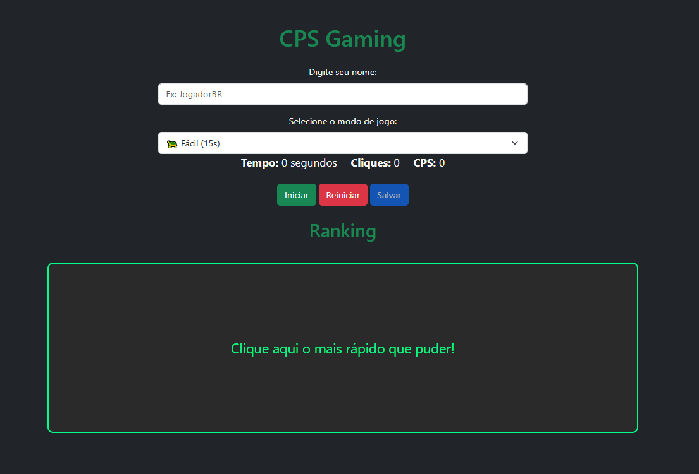

# 🎮 CPS Gaming

Projeto feito com foco em medir **cliques por segundo (CPS)** de forma simples, rápida e responsiva. Ideal para quem quer testar reflexos ou apenas se divertir clicando!

## ✨ Tecnologias Utilizadas

- **HTML5**
- **CSS3**
- **JavaScript (Vanilla)**
- **Cypress** (para testes automatizados)

## 🚀 Funcionalidades

- Contador de cliques por segundo (CPS)
- Timer ajustável
- Feedback visual em tempo real
- Layout responsivo para desktop e mobile
- Testes automatizados com Cypress para garantir funcionalidade

## 🧪 Testes com Cypress

Este projeto conta com automações de teste usando o **Cypress** para validar:

- Cálculo correto do CPS
- Comportamento do botão de clique
- Reset automático após o tempo
- Responsividade básica da interface

## 📸 Preview

## 🧠 Objetivo do Projeto
Esse projeto foi criado para praticar:

- Manipulação de DOM com JavaScript puro

- Lógica de temporização e contagem

- Estilização com CSS responsivo

- Testes automatizados com Cypress

- Experiencia com automação de testes.

## ✒️ Colaboração
Dev -  [Lucas](https://github.com/Chaves777)
